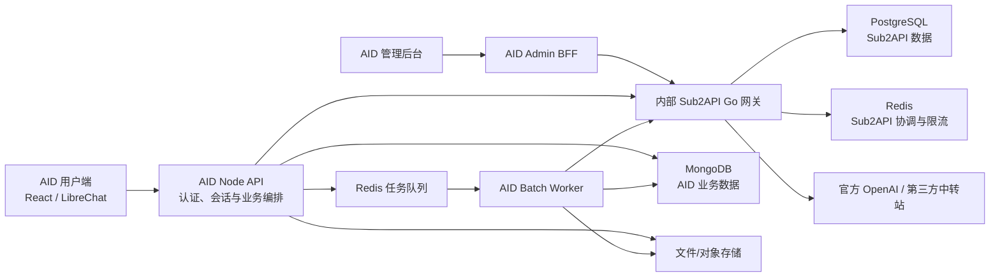
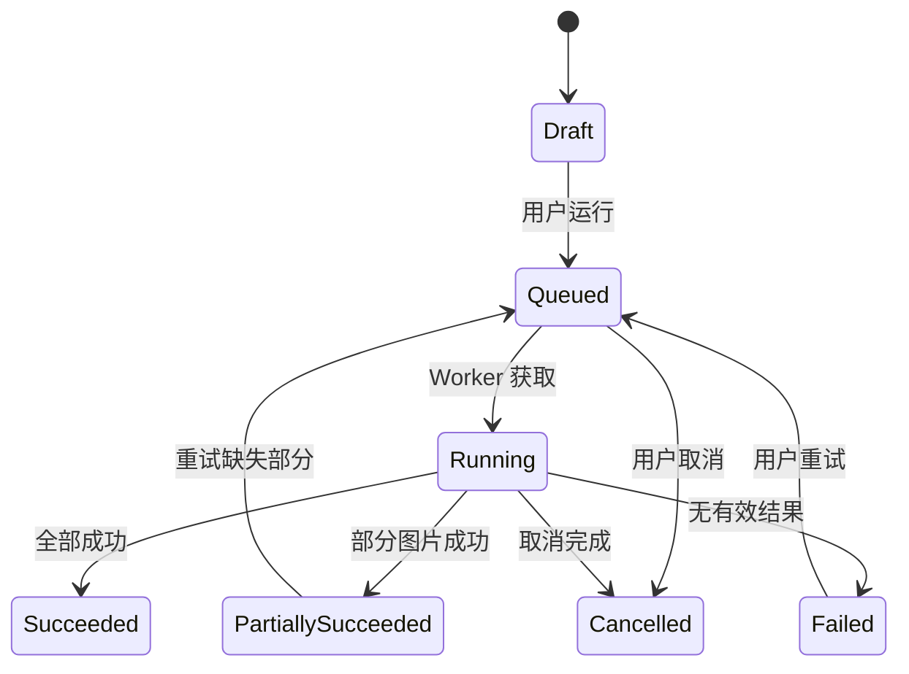

# AID 批量生图工作区与模型网关设计规格

- 日期：2026-07-14
- 状态：设计已确认，待书面规格复核
- 范围：AID 用户工作区、批量任务、图片资产与导出、收藏复用、管理后台模型账号、内部 Sub2API 网关集成

## 1. 背景

AID 当前以 LibreChat 为基础，已经具备用户认证、项目、会话、消息、文件、流式响应及独立管理面板。目标是在保留这些成熟基础能力的前提下，将用户端改造成面向批量 Chat/生图任务的工作台，并通过管理后台接入多个 OpenAI 兼容的官方或第三方中转账号。

第一期只支持 OpenAI 兼容协议。管理员统一配置共享账号，普通用户不绑定自己的 API Key。系统允许管理员配置多个账号和不同模型，但第一期不做自动账号路由、负载均衡或故障切换；用户自行选择具体的已发布模型账号。

本设计以已完成的 HTML 草稿 `docs/design/aid-workspace-concept.html` 为用户工作区视觉方向。草稿中的“收藏”和“模板”合并为一个功能，“模型配置”从用户导航移到管理后台。

## 2. 已确认的关键决策

1. AID 是主产品，负责用户、项目、会话、批量任务、收藏、资产和导出。
2. Sub2API 保持 Go 实现，作为仅内部可访问的 OpenAI 兼容网关服务。
3. AID 不重写 Sub2API 的 OpenAI 请求解析、上游兼容、账号调用和错误处理逻辑。
4. AID 管理后台提供简化的模型账号配置体验，并通过 AID 管理 BFF 调用 Sub2API 管理接口。
5. 每个用户可见的模型配置映射到一个只包含单个上游账号的 Sub2API 分组，确保用户选择的就是具体账号，不触发自主调度。
6. 批量导入只创建项目和会话草稿，不自动调用模型；用户检查后主动单条或批量运行。
7. 批量任务在服务端队列执行，并受全局及单用户并发限制；关闭浏览器不影响执行。
8. 收藏即模板。收藏保存不可变快照，复用时复制出新会话。
9. 项目和会话支持重命名、归档、删除及相应的批量操作。
10. 第一期导出支持原始文件、PNG、JPG、WEBP、逐张下载和 ZIP。

## 3. 目标与非目标

### 3.1 目标

- 一次导入多个项目和多个会话的初始内容，并在运行前完成校验。
- 在同一工作区完成会话管理、模型选择、Chat、生图、图片编辑、结果选择和导出。
- 通过管理后台配置多个 `Base URL + API Key + 模型名称` 的 OpenAI 兼容账号。
- 让用户明确选择具体模型账号，并保留每次执行所用配置的可审计快照。
- 提供稳定的异步批量任务、并发控制、暂停、取消、部分成功和失败重试。
- 建立收藏、快照、参考图和新会话之间的完整复用闭环。
- 保持 Sub2API 可独立升级，避免 AID 复制并分叉其协议实现。

### 3.2 非目标

- 第一阶段不支持 Anthropic、Gemini、国内模型或其他非 OpenAI 协议。
- 第一阶段不做账号池自动选择、权重调度、自动故障切换或智能负载均衡。
- 第一阶段不允许普通用户配置个人 Base URL 或 API Key。
- 第一阶段不建设计费、充值、套餐或用户额度系统。
- 第一阶段不直接向用户暴露 Sub2API 管理界面、内部地址、账号 ID、分组 ID 或内部 API Key。
- 第一阶段不复用 Sub2API 面向 Gemini/Vertex 的异步 Batch Image API；AID 自己编排多个 OpenAI Images 请求。

## 4. 总体架构

### 4.1 AID Node API

继续承担用户认证、权限、项目、会话、消息、文件访问和流式事件。新增以下边界清晰的模块：

- `ModelEndpoint`：维护 AID 公开模型与 Sub2API 资源映射。
- `ImportBatch`：解析、校验并落地批量导入草稿。
- `GenerationJob`：创建任务、维护状态并提供控制接口。
- `GeneratedAsset`：管理生成图片及其引用关系。
- `FavoriteSnapshot`：保存和复制收藏快照。
- `ExportJob`：编排格式转换、命名和 ZIP。

### 4.2 AID Admin BFF

管理后台不直接访问 Sub2API。Admin BFF 验证 AID 管理员权限，将简化的 AID 表单转换成 Sub2API 的账号、单账号分组、模型限制及内部调用凭据操作。BFF 只负责资源编排和字段映射，不解析 OpenAI Chat/Image 协议。

### 4.3 Sub2API

Sub2API 负责：

- 保存上游 Base URL 和 API Key。
- 解析和转发 OpenAI Chat、Responses、Images generations/edits 请求。
- 处理不同中转站的 OpenAI 兼容差异。
- 提供连接与模型调用测试。
- 标准化上游鉴权、限流、超时和协议错误。
- 记录网关侧运行信息并保护上游凭据。

每个 AID `ModelEndpoint` 对应一个只绑定单个账号的 Sub2API 分组。Sub2API 在该分组内没有第二个候选账号，因此不会替用户自主切换账号。

### 4.4 数据与运行基础设施

- MongoDB 是 AID 项目、会话、任务、收藏、资产元数据和导出状态的事实来源。
- PostgreSQL 是 Sub2API 账号、分组、渠道和网关状态的事实来源。
- AID 与 Sub2API 可以共享 Redis 实例，但必须使用不同数据库或强制键前缀；两者不能读取或删除对方的键。
- 图片和 ZIP 使用 LibreChat 现有文件存储抽象；不把图片 Base64 保存到 MongoDB 或 PostgreSQL。

## 5. 模型账号管理

### 5.1 管理员输入

每个配置包含：

- 用户可见显示名称。
- Base URL。
- API Key。
- Chat 模型名称，可选。
- Image 模型名称，可选。
- Chat 能力开关。
- Image generation 能力开关。
- Image edit 能力开关。
- 发布状态与启停状态。

至少启用一种能力，且对应模型名称不能为空。Base URL 只接受 HTTP/HTTPS；连接策略由部署配置限制允许访问的域名或网段。

### 5.2 保存流程

1. 管理员提交表单到 AID Admin BFF。
2. BFF 校验字段和管理员权限。
3. BFF 调用 Sub2API 管理接口创建或更新上游账号。
4. BFF 为该账号创建或更新单账号分组，并限制允许使用的模型。
5. BFF 创建或轮换供 AID 服务端调用的 Sub2API 内部凭据。
6. 全部 Sub2API 操作成功后，AID 保存 `ModelEndpoint` 公开字段和 Sub2API 资源引用。
7. 任一步失败时，BFF 回滚本次创建的远端资源；无法自动回滚的资源进入可重试的同步异常状态，不向用户发布。

上游 API Key 只保存在 Sub2API。AID 为调用 Sub2API 所需的内部凭据使用服务端加密存储，绝不返回给浏览器。

### 5.3 用户选择

用户端模型选择器只返回：

- AID 模型配置 ID。
- 显示名称。
- Chat/Image/Edit 能力。
- 可用状态。
- 管理员允许公开的模型说明。

用户选择具体配置后，任务和消息保存该配置的执行快照。配置后来改名不会改变历史记录；配置停用后历史内容仍可查看，但不能创建新调用。

## 6. 用户工作区

### 6.1 功能导航栏

- `工作区`：批量导入、项目会话、Chat、生图和导出。
- `收藏`：收藏快照列表、搜索、重命名、删除和二次使用。
- 保留账户和通用设置入口。
- 不提供独立的“模板”入口。
- 不向普通用户提供“模型配置”入口。

### 6.2 项目与会话列表区

支持：

- 导入多个项目和会话。
- 搜索、展开、收起和筛选。
- 项目/会话重命名。
- 项目/会话归档和查看已归档内容。
- 项目/会话删除及影响范围确认。
- 单条运行、勾选批量运行、暂停、取消和失败重试。
- 展示草稿、排队、运行、部分成功、成功、失败、取消状态。
- 批量归档和批量删除。

归档只改变默认可见性，不改变消息、任务和资产。删除正在运行任务所属的项目或会话前，必须先取消相关任务。

### 6.3 对话工作区

- 用户选择管理员发布的具体模型配置。
- 支持 LibreChat 现有流式 Chat。
- 支持 OpenAI Images generations 和 edits。
- 支持选择历史生成图片作为参考图继续对话。
- 每次运行保存模型配置、模型名、提示词、参数和参考图快照。
- 生成进度通过服务端事件更新；刷新后从持久状态恢复。

### 6.4 产出与导出区

- 汇总当前会话所有生成图片。
- 支持单选、多选和全选。
- 支持原始格式、PNG、JPG 和 WEBP。
- 支持保持原始尺寸或选择系统允许的目标尺寸。
- 支持逐张下载和 ZIP。
- 默认命名为 `会话标题_格式_序号.扩展名`。
- 文件名必须清理路径字符、控制字符和操作系统不兼容字符。

## 7. 批量导入与执行

### 7.1 导入

第一期支持 XLSX、CSV 和 JSON。导入文件至少表达：

- 项目名称。
- 会话标题。
- 初始提示词或会话内容。
- 可选模型配置 ID 或公开模型名称。
- 可选生成参数。

导入流程为解析、字段校验、模型匹配、预览、用户确认、创建草稿。错误行与正确行分离，错误行不阻止正确记录落地。导入完成不创建模型调用，也不产生上游费用。

### 7.2 执行

用户可以：

- 对单个会话运行。
- 勾选多个会话批量运行。
- 对项目内所有可运行会话运行。
- 暂停尚未开始的任务。
- 取消排队或运行任务。
- 对失败或部分成功任务重试。

任务使用服务端队列。并发限制包含全局上限和单用户上限，均由管理配置提供。队列状态不依赖浏览器进程。

### 7.3 状态机

同一会话、相同执行快照和同一次用户操作生成稳定的幂等键。重复点击、客户端重试或网络重放不能创建第二个计费任务。

部分成功必须保留已生成图片；重试只提交缺失输出。取消正在请求中的任务时，系统尽力中止请求；若上游已经返回有效结果，则保存结果并将取消事实记录在任务事件中。

## 8. 核心数据模型

### 8.1 `ModelEndpoint`

- AID ID、显示名称、能力、公开说明、状态。
- Chat/Image 上游模型名称。
- Sub2API 账号、分组、渠道和内部凭据引用。
- 配置版本、创建人、更新人、创建/更新时间。
- 最近连接测试状态及脱敏错误摘要。

### 8.2 `ImportBatch`

- 用户、源文件、文件哈希、导入格式。
- 总行数、成功数、失败数和逐行错误。
- 创建的项目与会话 ID。
- 解析、确认和完成时间。

### 8.3 `GenerationJob`

- 用户、项目、会话和父任务 ID。
- 模型配置 ID 与不可变执行快照。
- 提示词、消息上下文、参考图和生成参数。
- 预期输出数、成功数、失败数。
- 状态、尝试次数、幂等键和队列信息。
- 标准化错误、Sub2API 追踪 ID 和结果资产 ID。
- 创建、开始、结束和取消时间。

### 8.4 `GeneratedAsset`

- 所有者、来源任务、来源会话。
- 原始文件和缩略图引用。
- MIME 类型、扩展名、尺寸、字节数和校验哈希。
- 引用计数或引用关系。
- 创建时间和清理状态。

### 8.5 `FavoriteSnapshot`

- 所有者、名称、说明和标签。
- 来源项目/会话引用，仅用于追溯。
- 消息上下文快照。
- 选定参考图引用。
- 提示词、模型和生成参数快照。
- 创建和更新时间。

收藏内容在创建后不随源会话变化。用户编辑收藏名称、说明或标签不修改其执行快照。

### 8.6 `ExportJob`

- 所有者、会话、选中资产。
- 目标格式、尺寸、质量和打包方式。
- 命名规则和输出清单。
- 状态、错误、ZIP 文件引用和过期时间。

## 9. 收藏复用闭环

1. 用户从会话选择需要保留的上下文和参考图片。
2. AID 创建不可变 `FavoriteSnapshot`。
3. 资产引用关系增加，防止源会话删除时误删图片。
4. 用户点击“使用收藏”。
5. AID 创建新会话并复制消息上下文、提示词、模型参数和参考图引用。
6. 若原模型配置已经停用，新会话保留历史模型说明，但要求用户选择当前可用模型后才能运行。
7. 新会话与收藏互不影响。

## 10. 归档与删除

- 重命名只修改显示名称，不改变 ID、任务或资产路径。
- 归档项目时默认连同所属会话从活动列表隐藏，但不改变会话各自的归档标记。
- 归档会话只隐藏该会话。
- 删除会话会删除其消息和任务业务记录，并释放资产引用。
- 删除项目会级联处理所属会话。
- 被收藏、其他会话或有效导出引用的资产不能物理删除。
- 无引用资产通过异步清理任务删除，避免请求内执行大规模文件操作。
- 删除操作必须展示受影响的项目、会话、任务和图片数量，并要求二次确认。

## 11. 错误处理

AID 对用户公开稳定错误码和可执行建议，不依赖第三方原始文案：

- 模型配置已停用。
- 模型或能力不可用。
- 上游 API Key 无效。
- 上游余额或额度不足。
- 上游请求限流。
- 上游超时或网络不可用。
- 内容被上游策略拒绝。
- 图片格式、尺寸或参考图不支持。
- 中转站返回不兼容响应。
- Sub2API 内部服务暂时不可用。

第一期不自动切换账号。失败任务保留原参数和错误；用户选择另一模型配置后创建一次明确的新重试。原始上游错误只进入脱敏服务端诊断信息。

## 12. 安全设计

- Sub2API 管理和网关端点只在内部网络开放。
- AID Admin BFF 使用独立服务身份访问 Sub2API 管理接口。
- 普通用户不能读取或调用模型管理接口。
- 上游 API Key 只保存在 Sub2API；AID 不保存上游明文密钥。
- AID 内部 Sub2API 凭据使用服务端加密存储并支持轮换。
- 日志移除 Authorization、API Key、Cookie、图片 Base64 和完整上游响应。
- Base URL 访问受协议、域名/IP 策略、超时和响应体大小限制。
- 所有会话、任务、资产、收藏、导出和 ZIP 下载按用户校验权限。
- ZIP 文件名和归档路径进行规范化，阻止路径穿越。
- 下载地址需要登录或短期签名，并在过期后清理。
- 管理员模型变更、密钥轮换、测试、发布和停用进入审计日志。

发布前必须核对 Sub2API 的许可证义务、上游模型服务条款和第三方中转站条款，并保留所有依法需要的许可证及版权说明。

## 13. 可观测性

每次用户操作生成统一追踪链：

`ImportBatch ID → GenerationJob ID → AID Request ID → Sub2API Request ID → GeneratedAsset ID`

必须监控：

- 队列长度和等待时间。
- 全局及单用户运行并发。
- Chat/Image 成功率和延迟。
- 429、鉴权失败、超时和协议错误。
- 各公开模型配置的调用量与失败率。
- Worker 重启恢复和重复任务拦截。
- 图片持久化、格式转换和 ZIP 失败。
- 临时导出文件与无引用资产清理积压。

## 14. Sub2API 版本与升级策略

- Sub2API 保持独立的上游跟踪仓库或固定容器构建版本。
- AID 部署清单固定 Sub2API 提交或镜像摘要，禁止使用浮动 `latest`。
- AID 只依赖经过契约测试覆盖的管理接口和 OpenAI 兼容接口。
- 优先不修改 Sub2API 核心代码。
- 必须修改时维护小型、独立、可重放的补丁集，不把 AID 业务模型写入 Sub2API。
- 升级流程为：拉取上游、重放补丁、构建候选版本、运行契约测试、测试环境冒烟、灰度、正式发布。
- 升级失败时回退到上一固定版本；AID 的 `ModelEndpoint` 映射保持兼容。

## 15. 测试策略

### 15.1 单元测试

- XLSX/CSV/JSON 解析和字段校验。
- 模型匹配和配置快照。
- 项目/会话重命名、归档和删除规则。
- 任务状态机、幂等键、并发计数和部分重试。
- 文件名规范化、格式参数和资产引用。
- 收藏快照创建与复制。
- 错误标准化和日志脱敏。

### 15.2 集成测试

- AID Admin BFF 创建、更新、测试、发布、停用和删除 Sub2API 资源。
- 模型列表只返回公开安全字段。
- Chat 流、Images generations/edits 和参考图调用。
- Worker 获取、执行、恢复、暂停、取消和重试。
- 图片存储、转换、ZIP 和过期清理。
- 项目删除与收藏资产引用保护。

### 15.3 Sub2API 契约测试

- 账号、单账号分组和内部凭据生命周期。
- Chat/Responses 流式协议。
- Images generations 和 edits。
- 鉴权失败、限流、超时、模型不存在和不兼容响应。
- 追踪 ID 传递和日志脱敏。

### 15.4 端到端测试

- 导入 → 检查 → 批量运行 → 查看结果 → 对话修改 → 多格式导出。
- 收藏 → 创建新会话 → 恢复上下文和参考图 → 再次生成。
- 重命名、归档、恢复查看和删除项目/会话。
- 页面刷新、浏览器关闭和服务重启后的任务恢复。
- 多用户权限隔离和并发限制。

## 16. 分阶段交付

### 阶段 0：网关基线

- 固定 Sub2API 版本。
- 建立内部部署、服务鉴权、PostgreSQL/Redis 隔离和 AID Adapter。
- 建立升级与回滚流程及最小契约测试。

验收：AID 可访问内部 Sub2API；外部不能访问管理接口；候选版本可以回滚。

### 阶段 1：模型账号后台

- 新增 AID 模型账号页面与 Admin BFF。
- 实现账号、单账号分组、凭据、连接测试、发布和停用。

验收：管理员能配置多个 OpenAI 兼容账号；用户只能看到已发布公开字段。

### 阶段 2：Chat 接入

- 将用户选择的具体配置映射到 Sub2API。
- 保留 LibreChat 流式会话、消息持久化和错误展示。

验收：用户能手动选择不同账号；Chat 流和历史会话正常；系统不自动切换账号。

### 阶段 3：项目与批量导入

- 增加导入、预览校验、草稿创建和错误行反馈。
- 增加项目/会话重命名、归档、删除及批量处理。

验收：导入后不调用模型；用户可以检查、修正和整理历史或错误记录。

### 阶段 4：批量生图队列

- 增加任务模型、Redis Worker、并发限制和控制接口。
- 通过 Sub2API 调用 OpenAI Images generations/edits。

验收：关闭页面后继续执行；任务可恢复；重复操作不重复计费；部分成功可重试缺失部分。

### 阶段 5：四层工作区

- 将 HTML 草稿转成 AID React 生产组件。
- 整合项目列表、对话、模型选择、任务状态和产出区。

验收：用户在一个工作区内完成导入检查、执行、对话调整和结果选择。

### 阶段 6：图片资产与导出

- 增加缩略图、选择、格式转换、逐张下载、ZIP 和命名规则。

验收：用户能按会话标题和格式批量导出；单项失败可定位和重试。

### 阶段 7：收藏复用闭环

- 合并收藏与模板。
- 增加快照、资产引用和复制新会话。

验收：收藏不受源会话变化影响；复用后可以直接继续生成。

### 阶段 8：品牌与上线收口

- 移除或弱化 LibreChat 用户可见标识。
- 完成权限、审计、监控、迁移、清理和灰度开关。

验收：普通用户看不到 LibreChat/Sub2API 内部概念；新能力可灰度、回滚并被完整监控。

## 17. 上线门槛

- 固定 Sub2API 版本的全部契约测试通过。
- AID API 或 Worker 重启后任务恢复到正确状态。
- 重复点击、客户端重试和网络抖动不创建重复计费任务。
- 停用模型配置后不能创建新调用，历史记录仍可读取。
- 用户之间无法读取对方会话、任务、图片、收藏或 ZIP。
- 日志和前端响应中不存在上游密钥或内部凭据。
- 核心链路具有统一追踪 ID 和告警指标。
- 新工作区与模型网关均受功能开关控制。
- 测试环境完成导入、批量生图、对话修改、收藏复用和导出全链路冒烟。

## 18. 设计完成条件

本设计在以下条件下视为完整：

- AID 与 Sub2API 的职责边界清晰，AID 不复制 OpenAI 协议实现。
- 用户选择具体模型账号，不存在隐式自动调度。
- 导入、运行、收藏、导出和删除行为无相互矛盾。
- 任务状态、重试、取消和资产引用规则可被确定性测试。
- 第一阶段范围不依赖其他模型厂商、计费或个人 API Key。
